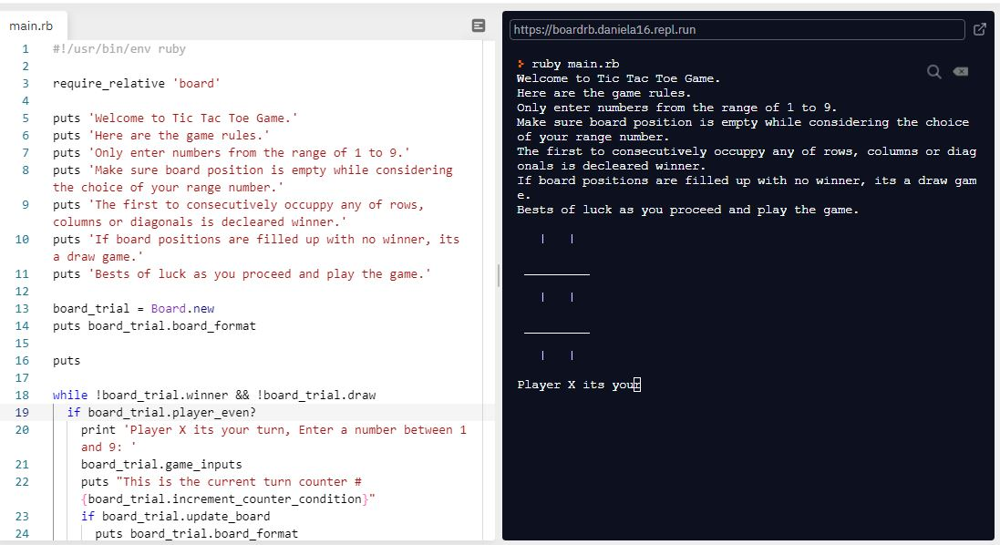

# Tic Tac Toe Game

## About
Tic-Tac-Toe game an OOP project at [Microverse]
TicTacToe is a 3x3 grid dual player game that assignes symbols(Xs,Os) to players. The final outcome is either a tie or a win. There are 8 possible winning combinations from a player, player can win by making 3 consecutive moves either vertically, horizontally or diagonally. A player has maximum of 5 possible moves. The aim of this project was to enhance one's competence in the OOP with the ruby language

 
## Built With

- RUBY

[ONLINE GAME LINK](https://repl.it/join/rbmggbqc-daniela16)


## Game Rules

- The system assignes a symbol(X or O) to player
- The player can make moves by pressing a number (of choice) on his/her keyboard
- The position a player is choosing should not have been taking
- The move made by a user should be a number otherwise its an invalid move
- A player can win by making three consecutive moves vertically, horizontally or diagonally
- If all position has been taken and there is no winner then its a tie(draw) For more detailed information on the game rules [CLICK HERE](https://www.thesprucecrafts.com/tic-tac-toe-game-rules-412170)


# Getting Started 🚀

These instructions will get you a copy of the game up and running on your local machine.

## How To Use 🔧

From your command line, first clone the project:  

```bash
# Clone this repository
$ git clone https://github.com/Alaska01/tic-tac-toe
$ cd tic-tac-toe
$ cd bin/main

```

## Author
👤 **Aye Daniel A*****

- [Github](https://github.com/Alaska01)
- [Twitter](https://twitter.com/AyeAsoo)
- [Linkedin](https://www.linkedin.com/in/daniel-asoo-aye/)

## Show your support

Give a ⭐️ if you like this project!

## Acknowledgments

- I acknowledge Microverse, the global remote school for developers.
- I appreciate The Odin Project for providing the project and making lessons simple to learn.

## 📝 License

This project is [MIT](lic.url) licensed.
